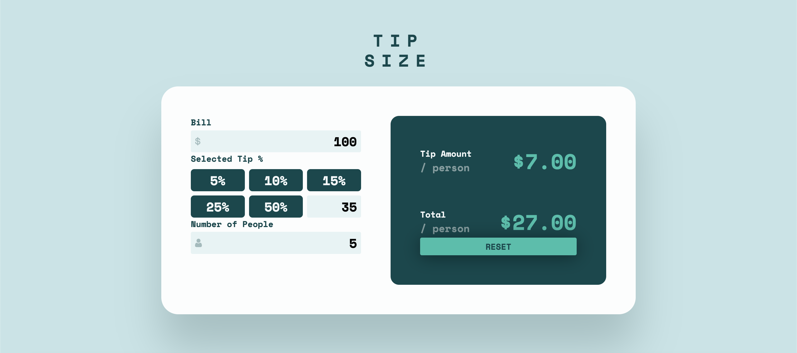

# TipSize

**TipSize** is a responsive and interactive tip calculator application built with **React** and **Vite**. Designed for a seamless user experience, it allows users to quickly calculate tip amounts and the total cost per person with customizable options.

---

## **Features**
- **Dynamic Calculations**: 
  - Automatically calculates the tip amount and total per person as the user inputs values.
- **Preset and Custom Tip Selection**: 
  - Choose from preset tip percentages (5%, 10%, 15%, 25%, 50%) or enter a custom tip percentage.
- **Error Handling**:
  - Displays an error message if the "Number of People" input is zero.
- **State Reset**:
  - A "Reset" button to clear all inputs and selections.
- **Responsive Design**:
  - Optimized for desktop and mobile devices.

---

## **Technologies Used**
- **React**:  
  Component-based architecture for better reusability and maintainability.
- **Vite**:  
  A fast development environment for building modern web applications.
- **JavaScript (ES6+)**:  
  Logic implementation for state management and calculations.
- **CSS**:  
  Custom styling for a clean and responsive user interface.
- **pnpm**:  
  Efficient package management and project setup.

---

## **Screenshots**

### **Default View**
The main screen of the application with preset tip options and input fields for bill and number of people.


### **Error State**
Displays a user-friendly error message when the "Number of People" is set to zero.


### **Custom Tip Entry**
Allows users to input a custom percentage for tip calculation.


---

## **Getting Started**

### **Prerequisites**
- **pnpm** package manager installed. If not, install it using:
  ```bash
  npm install -g pnpm
  
### Installation and Local Development
1. **Clone the repository**:
   ```bash
   git clone https://github.com/KamilBarczyk/TipSize

2. **Navigate to the project folder:**
   ```bash
   cd TipSize

3. **Instal dependencies:**
   ```bash
    pnpm install

4. **Run the project:**
   ```bash
   pnpm run dev
   
The app will be available at http://localhost:3000.